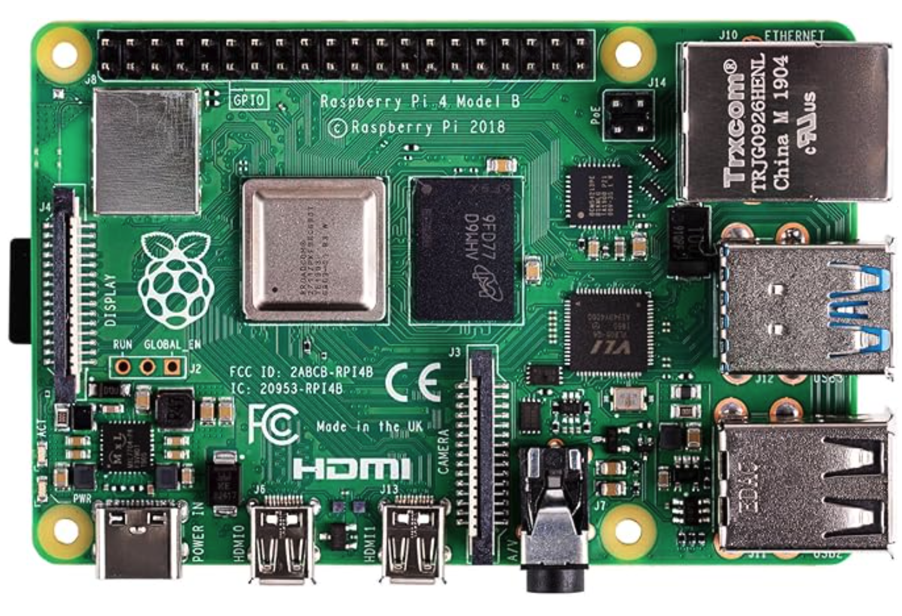
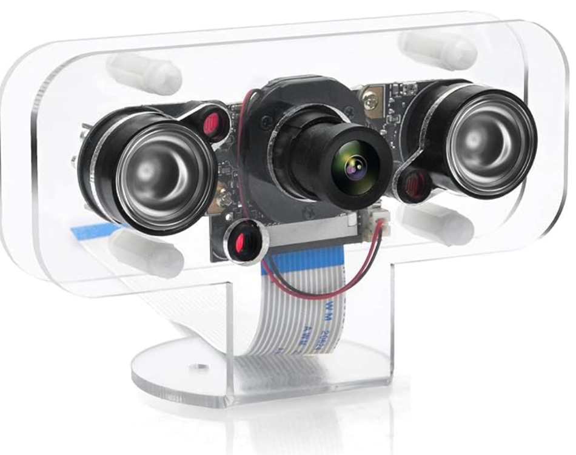

# RaspberryPi-Baby-Monitor-Server

This code was tested on Raspberry Pi 4 Model B, a camera, and a microphone bought from Amazon.

This project is developed with the following technologies:

- **Python**: Version 3.11.2
- **Picamera2**: Utilized for capturing images from the camera.
- **FastAPI**: Employed to serve images and audio to the web browser.
- **FFmpeg**: Used for streaming audio from the microphone to the web browser.

# Used Hardware

- Raspberry Pi 4 Model B (4GB) : [AMAZON Link](https://amzn.asia/d/4z4v2ZW)



- Camera: OSOYOO IR-CUT Camera for Raspberry Pi : [AMAZON Link](https://www.amazon.co.jp/dp/B08K9348F6?ref=ppx_yo2ov_dt_b_fed_asin_title)



- Microphone: USB Microphone : [AMAZON Link](https://www.amazon.co.jp/dp/B0CD7KPH3K?ref=ppx_yo2ov_dt_b_fed_asin_title)


## Folder structure

```
.
└── static  // static files
    ├── imgs
    │   ├── background.jpg  // web server background
    │   ├── icon.png        // web server icon
    │   ├── IR-Camera.png   // camera image
    │   ├── Raspberry-Pi-4-Model-B.png // Raspberry Pi 4 Model B image
    │   ├── USB-Microphone.png // microphone image
    │   └── webserverpage.png // web server page image
    ├── index.html          // web server index page
    └── manifest.json       // web server manifest
├── main.py               // contains main application logic for the web server, handling requests and serving images and audio streams to clients.
├── README.md             // readme file
├── requirements.txt      // python dependencies
└── LICENSE               // license

```

## How to run

clone the repository
```
git clone repository-url
cd RaspberryPi-Baby-Monitor-Server
```

Create a virtual environment and install the dependencies
```
python3 -m venv venv  
source venv/bin/activate
```

Install the dependencies
```
pip install -r requirements.txt
```

Create screen for the server (this is to keep the server running even after closing the terminal)
```
screen -S baby_monitor
```

Run the server
```
uvicorn main:app --reload --host 0.0.0.0 --port 8000
```

You should get an output like this click the link and view the web server

```
INFO:     Uvicorn running on http://0.0.0.0:8000 (Press CTRL+C to quit)
```


